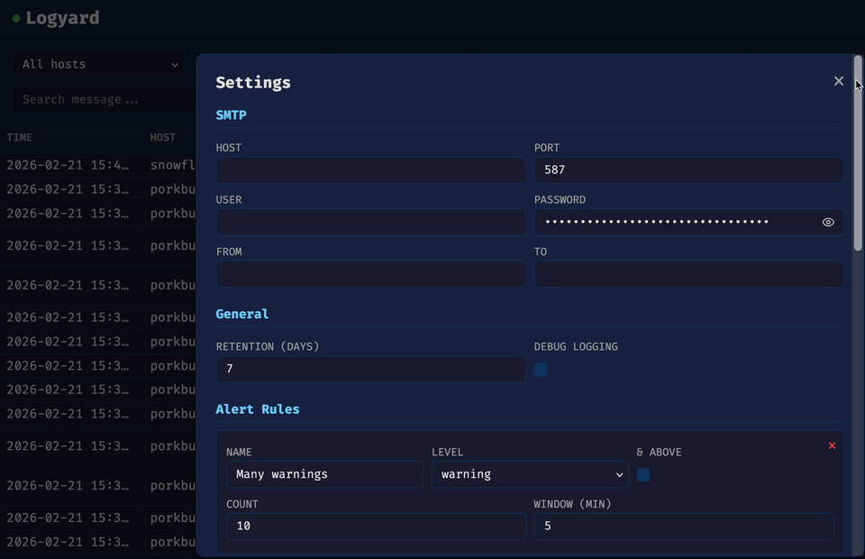

# Logyard

A lightweight syslog aggregator with web UI and email alerting. Single Go binary, SQLite storage, no external dependencies. Accepts both RFC 3164 (BSD) and RFC 5424 syslog messages over UDP and TCP. Can also ingest Docker container logs directly via the Docker socket, with proper stdout/stderr to severity mapping.


---



---

## Build

Requires Go 1.25+ and CGO (for SQLite).

```shell
CGO_ENABLED=1 go build -o logyard .
```

## Usage

```shell
./logyard -config ./config.yaml
```

Logyard looks for `config.yaml` in the current directory or `/etc/logyard/config.yaml`.

### Flags

```text
-config string    Path to config.yaml
-alert-interval   Alert evaluation interval (default 60s)
```

## Config

See [config.yaml.example](config.yaml.example) for a full example.

```yaml
# db_path: ./logyard.db
# retention: 14  # days
# debug: false
# web_addr: ":8080"

listen:
  udp: ":514"
  tcp: ":514"

smtp:
  host: smtp.example.com
  port: 587
  user: alerts@example.com
  password: secret
  from: alerts@example.com
  to: admin@example.com

alerts:
  - name: "Many warnings"
    count: 10
    window_minutes: 5
    level: warning
  - name: "Any critical"
    count: 1
    window_minutes: 5
    level: crit

ignore:
  - host: noisy-box.lan
  - facility: kern
  - tag: CRON
  - host: proxmox
    level: warning
  - message: "CRON|systemd-.*"

docker:
  enabled: true
  socket: "unix:///var/run/docker.sock"  # or "tcp://proxy:2375"
```

### Docker log ingestion

Logyard can ingest container logs directly from Docker via the Docker socket or a [docker-socket-proxy](https://github.com/Tecnativa/docker-socket-proxy). This provides proper severity mapping that Docker's built-in syslog driver lacks:

- **stdout** is logged as severity `info`
- **stderr** is logged as severity `err` (configurable per container via label)
- **Facility** is set to `docker`
- **Tag** is the container name
- **Host** is `localhost` for unix sockets, or the hostname from the TCP address

Some applications (e.g. Python/Django) write all output to stderr. To override the stderr severity for a container, add a `logyard.stderr` label:

```yaml
services:
  paperless:
    image: ghcr.io/paperless-ngx/paperless-ngx
    labels:
      logyard.stderr: "info"
```

Valid values are any syslog severity: `emerg`, `alert`, `crit`, `err`, `warning`, `notice`, `info`, `debug`.

```yaml
docker:
  enabled: true
  socket: "unix:///var/run/docker.sock"
```

When using a docker-socket-proxy, set `CONTAINERS=1` to allow access to the container list and log endpoints:

```yaml
# docker-compose.yml
services:
  socket-proxy:
    image: tecnativa/docker-socket-proxy
    volumes:
      - /var/run/docker.sock:/var/run/docker.sock:ro
    environment:
      CONTAINERS: 1
```

Then point logyard at the proxy:

```yaml
docker:
  enabled: true
  socket: "tcp://socket-proxy:2375"
```

### Alert rules

Every alert rule requires `count`, `window_minutes`, and `level`. The alerter checks every 60s (configurable via `-alert-interval`) and sends an email when the threshold is reached. Cooldown prevents re-alerting within the same time window.

### Ignore rules

Each rule matches on all specified fields (AND). Multiple rules are OR'd. Ignore rules apply to alerting only -- all logs are stored and visible in the UI.

The `message` field supports regular expressions using Go's [RE2 syntax](https://github.com/google/re2/wiki/Syntax) (e.g. `CRON|systemd-.*`).

## Web UI

Open `http://localhost:8080`. Auto-refreshes every 3 seconds. Filter by host, facility, severity, tag, or free-text search.

Logyard does not provide authentication or TLS. Use a reverse proxy like [Caddy](https://caddyserver.com/) for HTTPS and access control.

## Docker

```shell
docker run -d \
  -v ./config.yaml:/data/config.yaml \
  -v logyard-data:/data \
  -p 514:514/udp \
  -p 514:514/tcp \
  -p 8080:8080 \
  --name logyard \
  --restart unless-stopped \
  mietzen/logyard:latest
```

Or with docker compose:

```yaml
services:
  logyard:
    image: mietzen/logyard:latest
    container_name: logyard
    volumes:
      - ./config.yaml:/data/config.yaml
      - logyard-data:/data
    ports:
      - "514:514/udp"
      - "514:514/tcp"
      - "8080:8080"
    restart: unless-stopped

volumes:
  logyard-data:
```

## Systemd

```shell
sudo cp logyard /usr/local/bin/
sudo mkdir -p /etc/logyard /var/lib/logyard
sudo cp config.yaml /etc/logyard/
sudo cp logyard.service /etc/systemd/system/
sudo systemctl enable --now logyard
```

Port 514 requires `CAP_NET_BIND_SERVICE` (included in the service file). During development, use ports above 1024.
